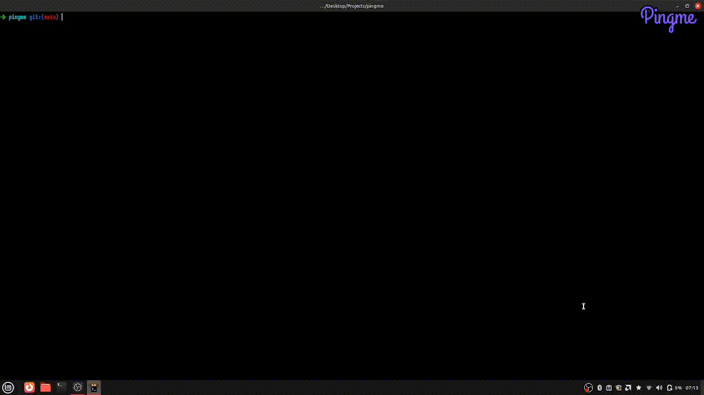

<div align="center">

# 🚀 PingMe CLI


### *A blazingly fast terminal-based server uptime monitoring tool*

<p align="center">
  
  
  
  
</p>

<p align="center">
  <strong>Monitor your servers with style - built with Rust and Ratatui</strong>
</p>

<p align="center">
  <a href="#-quick-start">Quick Start</a> •
  <a href="#-installation-options">Installation</a> •
  <a href="#-usage">Usage</a> •
  <a href="#-contributing">Contributing</a>
</p>

</div>

---

## 🎬 See It In Action

<!-- Tutorial GIF Placeholder -->
<div align="center">
  
</div>

---

## ✨ Features

<div align="center">

| Feature | Description |
|---------|-------------|
| 🔄 **Real-time Monitoring** | Polls endpoints every 60 seconds with HTTP health checks |
| 💾 **Persistent Storage** | (In dev) SQLite database for historical data and statistics |
| 🎨 **Beautiful TUI** | Interactive terminal interface with live graphs and tables |
| 🏗️ **Clean Architecture** | Built with the Visitor pattern for maintainability |
| 🔁 **Smart Retry Logic** | 3 retry attempts with exponential backoff |
| ⚙️ **Flexible Configuration** | Command line args, TOML files, or default `.ping` config |
| 🐳 **Docker Ready** | Available as a Docker container |
| 📊 **Rich Analytics** | Uptime percentages, latency tracking, and historical graphs |
| 🎯 **Developer Mode** | Advanced logging and debugging features |

</div>

---

## 🚀 Quick Start

### ⚡ One-Line Installation

```bash
curl -L https://github.com/abhayymishraa/pingme-tui/releases/download/v1.0.0/pingme-v1.0.0-x86_64-unknown-linux-gnu.zip -o pingme.zip && unzip pingme.zip && chmod +x pingme && sudo mv pingme /usr/local/bin/
```

### 🖥️ Platform Support

<div align="center">

| Platform | Architecture | Status | Download |
|----------|-------------|---------|----------|
| 🐧 **Linux** | x86_64 | ✅ **Supported** | [Download](https://github.com/abhayymishraa/pingme-tui/releases) |
| 🍎 **macOS** | x86_64 | ✅ **Supported** | [Download](https://github.com/abhayymishraa/pingme-tui/releases) |
| 🪟 **Windows** | x86_64 | 🔄 **Coming Soon** | - |

</div>

---

## 📦 Installation Options

<details>
<summary><strong>🎯 Option 1: Pre-built Binaries (Recommended)</strong></summary>

Download the latest release for your platform:

#### 🐧 Linux (x86_64)
```bash
wget https://github.com/abhayymishraa/pingme-tui/releases/download/v1.0.0/pingme-v1.0.0-x86_64-unknown-linux-gnu.zip
unzip pingme-v1.0.0-x86_64-unknown-linux-gnu.zip
chmod +x pingme
sudo mv pingme /usr/local/bin/
```

#### 🍎 macOS (x86_64)
```bash
wget https://github.com/abhayymishraa/pingme-tui/releases/download/v1.0.0/pingme-v1.0.0-x86_64-apple-darwin.zip
unzip pingme-v1.0.0-x86_64-apple-darwin.zip
chmod +x pingme
sudo mv pingme /usr/local/bin/
```

</details>

<details>
<summary><strong>🐳 Option 2: Docker</strong></summary>

```bash
docker run -it --rm abhaymishra129/pingme:latest
```

**With custom config:**
```bash
docker run -it --rm -v $(pwd)/pingme.toml:/app/pingme.toml abhaymishra129/pingme:latest --config /app/pingme.toml
```

</details>

<details>
<summary><strong>🔨 Option 3: Build from Source</strong></summary>

```bash
git clone https://github.com/abhayymishraa/pingme-tui.git
cd pingme-tui
cargo build --release
sudo cp target/release/pingme /usr/local/bin/
```

**Requirements:**
- Rust 1.70+ installed via [rustup](https://rustup.rs/)
- Git

</details>

---

## 🎯 Usage

### 🌐 Monitor a Single URL
```bash
pingme https://example.com
```

### 📋 Use Configuration File
```bash
pingme --config pingme.toml
```

### 🔍 Auto-detect Configuration
Place a `.ping` file in your current directory and run:
```bash
pingme
```

### 🐳 Docker Usage
```bash
# Quick start
docker run -it --rm abhaymishra129/pingme:latest

# With custom endpoints
docker run -it --rm abhaymishra129/pingme:latest https://example.com https://api.github.com
```

---

## ⚙️ Configuration

Create a `pingme.toml` or `.ping` file:

```toml
# 🌐 List of endpoints to monitor
endpoints = [
    "https://api.github.com",
    "https://httpbin.org/status/200", 
    "https://jsonplaceholder.typicode.com/posts/1",
    "https://www.google.com",
    "https://stackoverflow.com"
]

# ⏱️ Optional: Polling interval in seconds (default: 60)
interval_seconds = 60

# 🔄 Optional: Number of retry attempts (default: 3)
max_retries = 3

# ⏰ Optional: Request timeout in seconds (default: 10)
timeout_seconds = 10
```

### 📁 Configuration File Locations

PingMe looks for configuration files in this order:

1. `--config` flag specified file
2. `.ping` in current directory
3. `pingme.toml` in current directory
4. `~/.config/pingme/config.toml`

---


---

## 🔄 CI/CD Pipeline

<div align="center">

### Automated Build & Deployment Pipeline


</div>

Our robust CI/CD pipeline ensures code quality, cross-platform compatibility, and automated deployments through multiple GitHub Actions workflows:

### 📋 Pipeline Overview

<div align="center">

| Workflow | Trigger | Purpose | Platforms |
|----------|---------|---------|-----------|
| 🧪 **CI** | Push/PR to main/master/develop | Code quality & testing | macOS, Windows |
| 🏗️ **Build Test** | Push to main | Cross-platform builds | Ubuntu, macOS |
| 🐳 **Docker Build** | Push/PR to main | Container deployment | Ubuntu |
| 🚀 **Release** | New release published | Binary distribution | Linux, macOS |

</div>

### 🔍 Continuous Integration (CI)

**Triggers:** Pull requests and pushes to `main`, `master`, `develop`

**Quality Gates:**
- **🎨 Code Formatting** (`cargo fmt --check`) - Ensures consistent code style
- **🔍 Linting** (`cargo clippy`) - Catches common mistakes and improvements
- **📚 Documentation** (`cargo doc --no-deps --all-features`) - Validates docs generation
- **🧪 Testing** (`cargo test --locked --all-features --all-targets`) - Comprehensive test suite

**Testing Matrix:**
- 🍎 **macOS** (latest)
- 🪟 **Windows** (latest)

**Features:**
- ⚡ **Parallel execution** with `fail-fast: false`
- 🔄 **Dependency caching** with `Swatinem/rust-cache@v2`
- 📊 **Clippy reports** with `clechasseur/rs-clippy-check@v3`
- 🔒 **Lockfile validation** and auto-generation

### 🏗️ Cross-Platform Build Testing

**Triggers:** Push to `main` branch

**Build Matrix:**
- 🐧 **Ubuntu** (latest) - `x86_64-unknown-linux-gnu`
- 🍎 **macOS** (latest) - `x86_64-apple-darwin`

**Process:**
```yaml
- uses: actions/checkout@v3
- name: Install Rust
  uses: actions-rs/toolchain@v1
  with:
    toolchain: stable
    profile: minimal
    override: true
- name: Build project
  run: cargo build --release
```

### 🐳 Docker Build & Deployment

**Triggers:** Push/PR to `main` branch

**Deployment Pipeline:**

1. **🔨 Build Process:**
   1. Checkout source code with `actions/checkout@v3`
   2. Setup Docker Buildx with `docker/setup-buildx-action@v2`
   3. Authenticate with DockerHub using secrets

2. **📦 Container Creation:**
   1. Build using `./docker/Dockerfile.dockerhub`
   2. Tag as `abhaymishra129/pingme:latest`
   3. Push to DockerHub registry

3. **🚀 Auto-Deployment:**
   1. Trigger Render deployment via webhook
   2. Live application updates automatically

**Docker Configuration:**
```yaml
- name: Build and Push Image
  uses: docker/build-push-action@v5
  with:
    context: .
    file: ./docker/Dockerfile.dockerhub
    push: true
    tags: abhaymishra129/pingme:latest
```

### 🚀 Release Automation

**Triggers:** New GitHub release published (`types: [published]`)

**Binary Distribution:**
- **🐧 Linux** (`x86_64-unknown-linux-gnu`)
- **🍎 macOS** (`x86_64-apple-darwin`)

**Release Process:**
1. **🔨 Cross-compilation** for target platforms
2. **📦 Archive creation** with platform-specific naming
3. **⬆️ Automatic upload** to GitHub release assets

**Build Matrix:**
```yaml
strategy:
  matrix:
    include:
      - os: ubuntu-latest
        target: x86_64-unknown-linux-gnu
        artifact: pingme
      - os: macos-latest
        target: x86_64-apple-darwin
        artifact: pingme
```

**Artifact Naming Convention:**
```
pingme-{version}-{target}.zip
```

### ⚙️ Workflow Features

**Advanced Capabilities:**
- 🔄 **Concurrency Control** - Cancels previous runs on new pushes
- 📦 **Rust Caching** - Speeds up builds with dependency caching
- 🎯 **Target-specific Builds** - Optimized binaries for each platform
- 🔐 **Secure Secrets** - Protected DockerHub and deployment credentials
- 📊 **Parallel Testing** - Simultaneous testing across platforms

**Environment Variables:**
```yaml
env:
  CARGO_TERM_COLOR: always
```

### 🔐 Security & Secrets

**Protected Secrets:**
- 🐳 `DOCKERHUB_USERNAME` & `DOCKERHUB_TOKEN` - Container registry access
- 🚀 `RENDER_DEPLOY_HOOK` - Production deployment webhook
- 🔑 `GITHUB_TOKEN` - Release asset uploads (auto-generated)

**Security Measures:**
- 🔒 Secrets never exposed in logs
- 🛡️ Minimal permission scopes (`contents: write`, `checks: write`)
- 🔄 Automated dependency updates

---


## 🎮 Controls & Navigation

<div align="center">

### 🎯 Normal Mode
| Key | Action | Description |
|-----|--------|-------------|
| `↑` / `k` | **Navigate Up** | Move up in endpoint list |
| `↓` / `j` | **Navigate Down** | Move down in endpoint list |
| `a` | **Add URL** | Add new URL to monitor |
| `r` | **Refresh** | Refresh data manually |
| `d` | **Developer Mode** | Toggle developer mode |
| `q` | **Quit** | Exit application |

### ➕ Adding Mode
| Key | Action | Description |
|-----|--------|-------------|
| `Enter` | **Confirm** | Confirm URL input |
| `Esc` | **Cancel** | Cancel URL input |

### 🔧 Developer Mode
| Key | Action | Description |
|-----|--------|-------------|
| `↑` / `↓` | **Scroll Logs** | Navigate through logs |
| `c` | **Clear Logs** | Clear all logs |
| `d` / `q` | **Exit** | Exit developer mode |

</div>

---

## 📊 Interface Overview

### 📋 Endpoint Dashboard
<div align="center">

| Column | Description |
|--------|-------------|
| 🌐 **URL** | The monitored endpoint |
| 🟢 **Status** | Real-time UP/DOWN status with color coding |
| 📈 **Uptime %** | Historical uptime percentage |
| ⚡ **Avg Latency** | Average response time in milliseconds |
| 🕐 **Last Ping** | Timestamp of most recent check |

</div>

### 📈 Live Analytics
- **📊 24-hour History**: Visual uptime trends and patterns
- **🔄 Real-time Updates**: Live data as it streams in
- **🎯 Per-endpoint View**: Individual endpoint analytics and metrics
- **📉 Latency Graphs**: Response time visualization over time

### 🔍 Developer Console
- **📝 Live Logs**: Real-time application logging and events
- **🐛 Debug Information**: Detailed system and network information
- **❌ Error Tracking**: Monitor application health and issues
- **📊 Performance Metrics**: Internal application statistics

---

## 🏗️ Architecture & Design

<div align="center">

### 🎯 Built with Clean Architecture

**Visitor Pattern Implementation**

</div>

```
┌─────────────────┐    ┌─────────────────┐    ┌─────────────────┐
│   PingManager   │────│      App        │────│   TUI Layer     │
│   (Orchestrator)│    │ (State Manager) │    │   (Interface)   │
└─────────────────┘    └─────────────────┘    └─────────────────┘
         │                       │                       │
         ▼                       ▼                       ▼
┌─────────────────┐    ┌─────────────────┐    ┌─────────────────┐
│ StorageVisitor  │    │ PollingVisitor  │    │  ConfigManager  │
│ (SQLite Ops)    │    │ (HTTP Requests) │    │ (Configuration) │
└─────────────────┘    └─────────────────┘    └─────────────────┘
```

### 🧩 Core Components

| Component | Responsibility |
|-----------|----------------|
| **🎯 PingManager** | Orchestrates polling and endpoint management |
| **🖥️ App** | TUI state management and user interface logic |
| **💾 StorageVisitor** | SQLite database operations (in-memory ping results) |
| **🌐 PollingVisitor** | HTTP requests and intelligent retry logic |
| **⚙️ ConfigManager** | Configuration file parsing and validation |

---

## 🛠️ Development

### 📋 Prerequisites
- **Rust 1.70+** installed via [rustup](https://rustup.rs/)
- **Git** for version control
- **SQLite3** (optional, for database inspection)

### 🚀 Local Development

```bash
# Clone the repository
git clone https://github.com/abhayymishraa/pingme-tui.git
cd pingme-tui

# Run in development mode
cargo run

# Run with specific endpoints
cargo run -- https://example.com https://api.github.com

# Run with config file
cargo run -- --config examples/pingme.toml
```

### 🔨 Building Release

```bash
# Build optimized release
cargo build --release

# Run tests
cargo test

# Check code formatting
cargo fmt --check

# Run clippy lints
cargo clippy -- -D warnings
```
---

## 🤝 Contributing

<div align="center">

**We welcome contributions! 🎉**

[](https://github.com/abhayymishraa/pingme-tui/graphs/contributors)

</div>

### 🚀 How to Contribute

1. **🍴 Fork** the repository
2. **🌿 Create** your feature branch (`git checkout -b feature/amazing-feature`)
3. **💾 Commit** your changes (`git commit -m 'Add some amazing feature'`)
4. **📤 Push** to the branch (`git push origin feature/amazing-feature`)
5. **🔄 Open** a Pull Request

### 🐛 Reporting Issues

Found a bug? Have a feature request? 

- **🐛 [Report Bug](https://github.com/abhayymishraa/pingme-tui/issues/new?template=bug_report.md)**
- **✨ [Request Feature](https://github.com/abhayymishraa/pingme-tui/issues/new?template=feature_request.md)**

### 📝 Development Guidelines

- Follow Rust best practices and idioms
- Add tests for new functionality
- Update documentation for API changes
- Use conventional commit messages
- Ensure code passes `cargo clippy` and `cargo fmt`

---

<div align="center">

## 🌟 Star History

[](https://star-history.com/#abhayymishraa/pingme-tui&Date)

---

### 💖 Made with Love and Rust

<p>
  <a href="https://github.com/abhayymishraa/pingme-tui/issues">🐛 Report Bug</a> •
  <a href="https://github.com/abhayymishraa/pingme-tui/issues">✨ Request Feature</a> •
  <a href="https://github.com/abhayymishraa/pingme-tui">📖 Documentation</a>
</p>

<p>
  <strong>If you found this project helpful, please consider giving it a ⭐!</strong>
</p>

</div>
